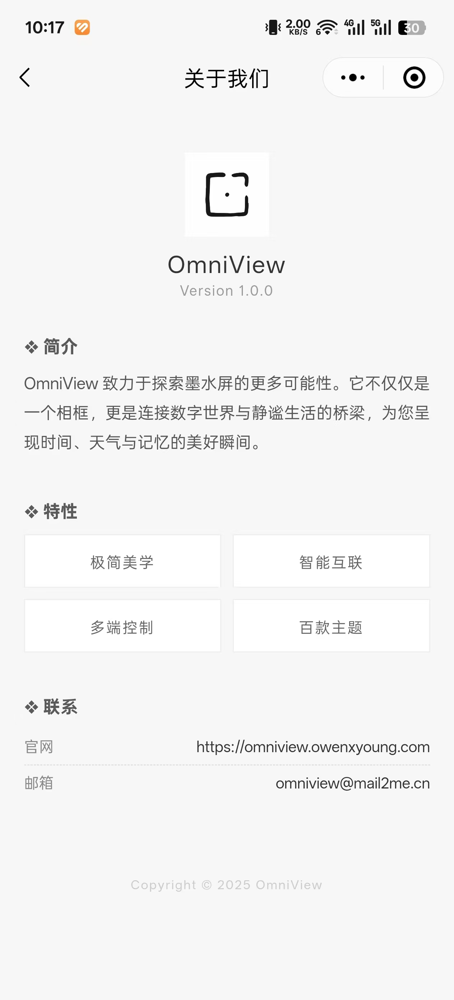
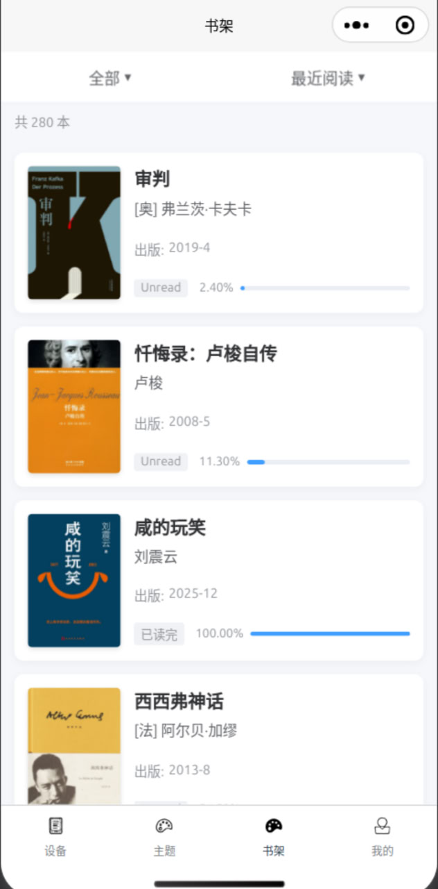
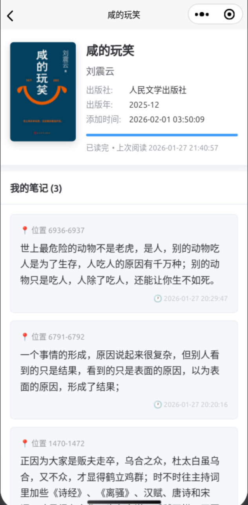
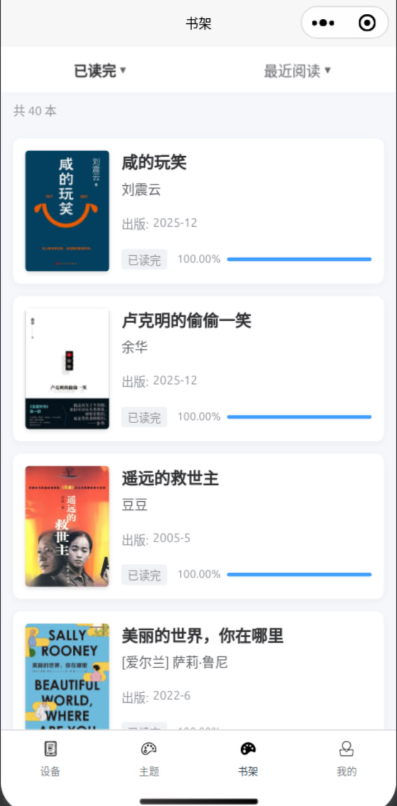
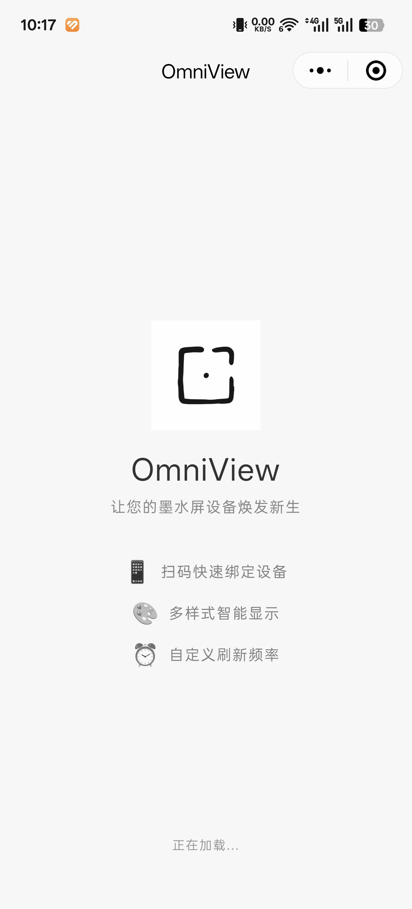
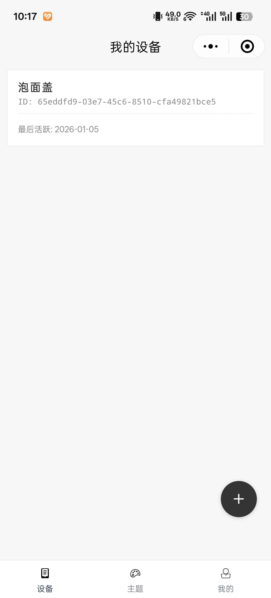
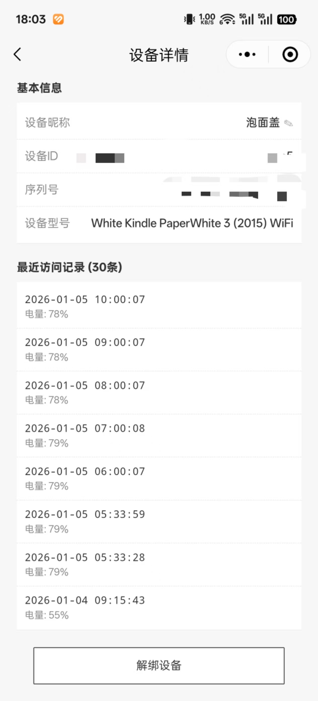

# 万象 (OmniView)

[简体中文](README.md) | [English](README_EN.md)

> **方寸之间，包罗万象。**

OmniView 是一个基于 KUAL 的 Kindle 插件，可将闲置的 Kindle 设备变身为智能电子墨水屏相框或信息展示屏，并支持书籍与笔记的自动同步。

---

## 功能特点

### 🖼️ 智能相框 (Photo Frame)
- **智能唤醒** - 利用 Kindle RTC (实时时钟) 实现深度休眠与定时唤醒，大幅延长电池续航
- **自动刷新** - 定期从服务器获取最新图像并自动展示
- **优雅外观** - 支持自定义主题、名言展示及日历挂件
- **防残影处理** - 启动时自动清屏，避免菜单残影

### 📚 书架同步 (Bookshelf Sync)
- **笔记采集** - 自动提取 Kindle 内的书籍信息与阅读笔记 (My Clippings.txt)
- **静默同步** - 智能监测 WiFi 连接与系统唤醒事件，后台自动执行同步，无需人工干预
- **云端管理** - 在小程序端随时查看、搜索和导出您的阅读笔记

### 🛠️ 系统特性
- **扁平化菜单** - 优化 KUAL 菜单结构，所有功能直达，导航深度仅需 2 层
- **超长续航** - 深度休眠模式下，一次充电可支持一个月以上的使用
- **状态管理** - 在屏幕下方直观显示电池电量、同步状态及运行模式

---

## 示例截图

### 🟢 智能相框
<div align="center">


<br>

</div>

<details>
<summary>查看更多相框样式</summary>
<div align="center">



</div>
</details>

### 🔵 书架笔记
<div align="center">



</div>

<details>
<summary>更多笔记界面</summary>
<div align="center">



</div>
</details>

<details>
<summary>点击查看小程序二维码及交流群</summary>
<div align="center">


</div>
</details>

---

## 安装与使用

### 前置准备

<details>
<summary>KUAL、fbink 安装指南 (如已安装请跳过)</summary>

#### KUAL
- [安装教程](https://bookfere.com/post/311.html#p_2)

#### USBNetwork Hack (含 fbink)
- [安装教程](https://bookfere.com/post/59.html)
- [官方发布页](https://www.mobileread.com/forums/showthread.php?t=225030)

</details>

### 安装步骤

1. 下载 [OmniView.zip](https://github.com/OmniViewApp/kindle-omni-view/releases/latest/download/OmniView.zip) 并解压
2. 将 `OmniView` 文件夹传输至 Kindle：
    - **USB 方式**：复制到 `/mnt/us/extensions/` 目录
    - **无线方式**：通过 `scp` 传输至 `/mnt/us/extensions/`
3. 断开 USB 数据线

### 使用流程

#### 1. 设备注册 (首次使用)
1. 在 Kindle 上打开 **KUAL** -> **OmniView** -> **Register Device**
2. 扫描屏幕二维码进行绑定
3. 注册成功后即可开始使用

#### 2. 配置相框 (手机端)
1. 在微信小程序中点击已绑定的设备
2. **选择来源**：可上传照片、订阅天气/日历插件或选择特定名言库
3. **设置频率**：建议 1-3 小时刷新一次以平衡电量与实时性

#### 3. 运行与停止

**启动运行**
- 点击 **Start Frame** 即可开始循环展示图片

**停止运行**
- **方式一**：按下电源键唤醒，待屏幕显示 `stopping...` 后自动退出至主页
- **方式二**：长按电源键强制关机

#### 4. 书架同步 (Bookshelf)

- **手动同步**: 点击 **Sync Bookshelf** 立即提取 Kindle 内的 `cc.db` 和 `My Clippings.txt` 并上传。
- **自动同步**: 点击 **Enable Auto-Sync**。开启后，设备会在侦测到 WiFi 连接或系统唤醒时自动在后台静默同步数据。
- **状态查看**: 点击 **Status** 可以在屏幕底部查看最后一次同步的时间及监听器运行状态。

#### 4. 状态查看 (Status)
点击 **Status**，屏幕下方会短暂显示：
- `Auto=Enabled/Disabled`: 自动同步开关状态
- `Monitor=Running/Stopped`: 事件监听器状态
- `LastSync`: 最近一次成功同步的时间

---

## 文件说明

### 工作目录结构

为了保持系统整洁，插件主体位于 `extensions/OmniView`，而用户配置与运行日志存储在：

```
/mnt/us/OmniView/
├── conf/
│   ├── config.cfg          # 核心配置文件
│   └── *.pid               # 进程标识文件
├── logs/
│   ├── app.log              # 运行总日志
│   └── update.log           # 更新日志
└── tmp/                     # 缓存图像
```

如遇问题，请首选检查 `/mnt/us/OmniView/logs/app.log`。

---

## 常见问题

| 问题 | 解决方案 |
|------|----------|
| 显示 "Register Failed" | 请确认 WiFi 正常连接且已在小程序端创建账号 |
| 无法自动刷新 | 请检查 `config.cfg` 中的刷新率设置或 WiFi 信号 |
| 菜单显示不全 | 请确保 `templates/kual/menu.json` 完整且未被截断 |

---

## 问题反馈
- [Telegram 群组](https://t.me/OmniViewApp)
- 提交 [Issue](https://github.com/OmniViewApp/kindle-omni-view/issues)

---

## 许可证

[GPL-3.0](LICENSE.txt)
