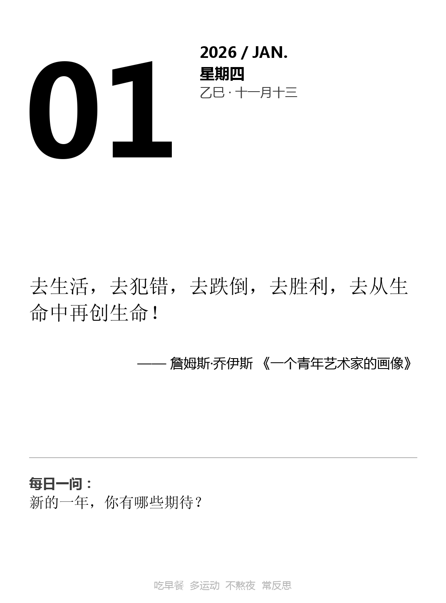
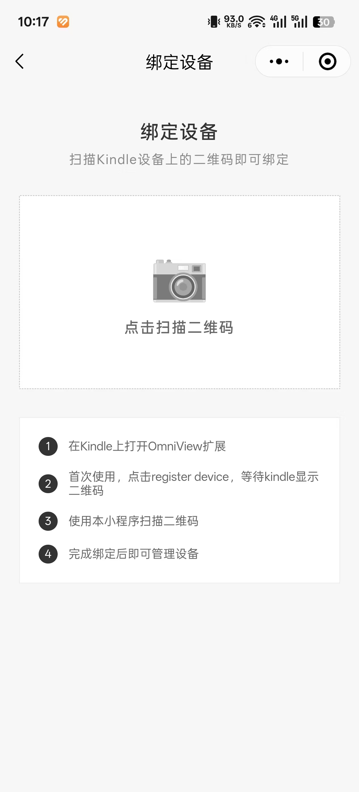
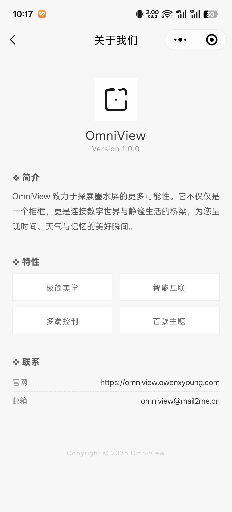
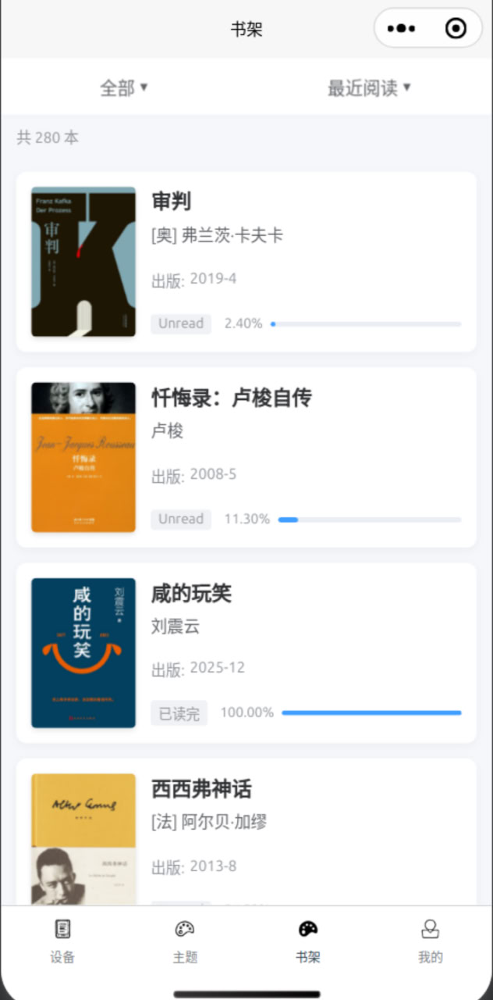
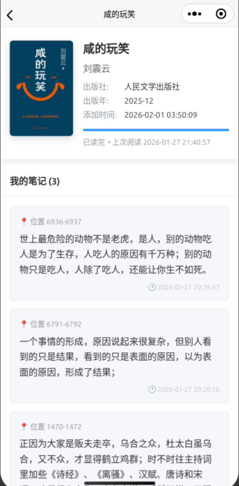
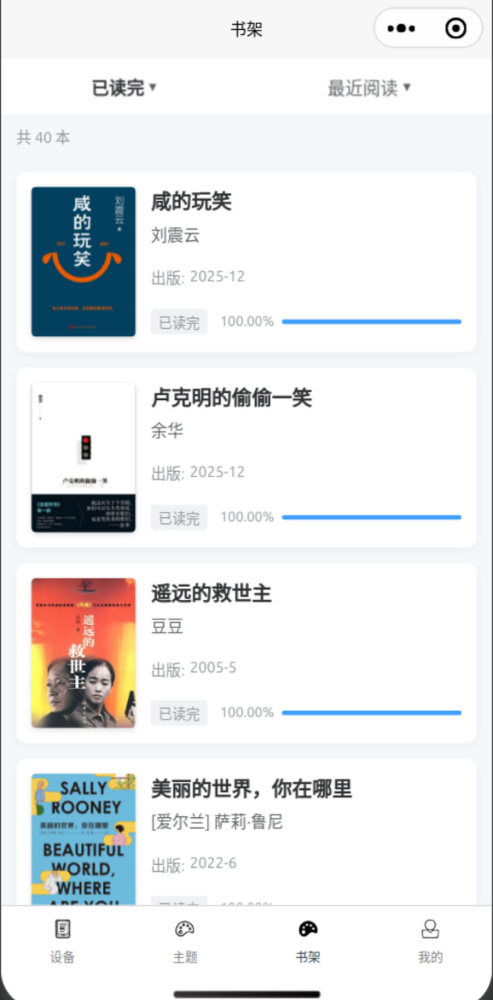
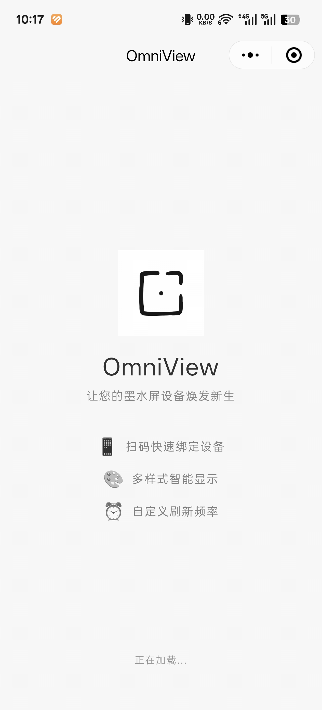
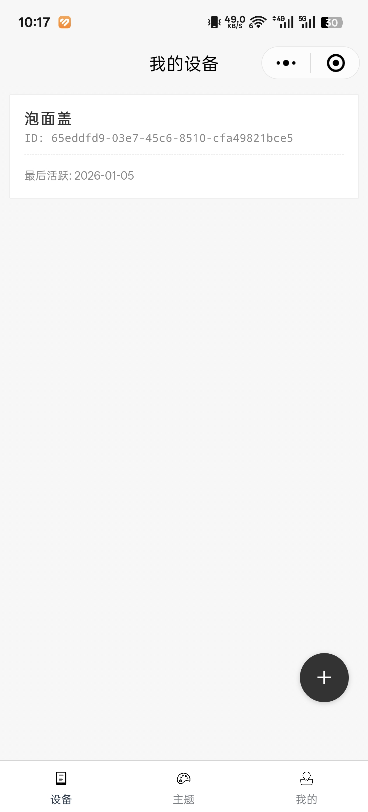
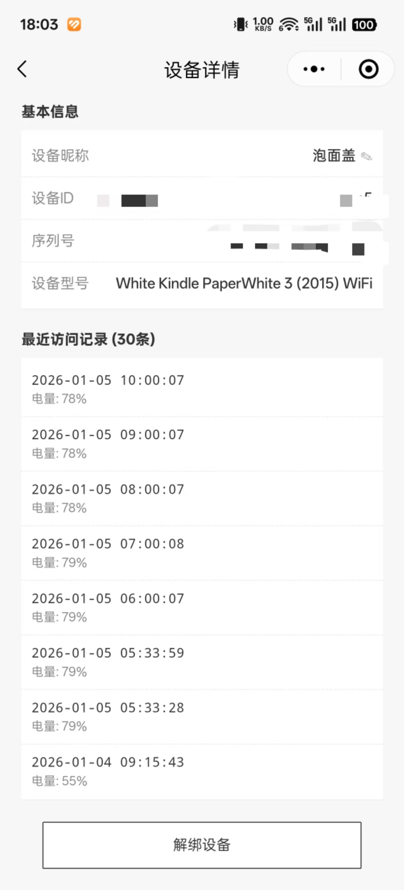

# 万象 (OmniView)

[简体中文](README.md) | [English](README_EN.md)

> **方寸之间，包罗万象。**

OmniView 是一个基于 KUAL 的 Kindle 插件，可将闲置的 Kindle 设备变身为智能电子墨水屏相框或信息展示屏，并支持书籍与笔记的自动同步。

---

## 功能特点

### 🖼️ 智能相框 (Photo Frame)
- **智能唤醒** - 利用 Kindle RTC (实时时钟) 实现深度休眠与定时唤醒，大幅延长电池续航
- **自动刷新** - 定期从服务器获取最新图像并自动展示
- **优雅外观** - 支持自定义主题、名言展示及日历挂件
- **防残影处理** - 启动时自动清屏，避免菜单残影

### 🖼️ 休眠壁纸 (Sleep Wallpaper)
- **每日壁纸** - 将每日精选壁纸显示在 Kindle 原生锁屏/屏保界面，正常阅读完全不受影响
- **无需 ScreenSavers Hack** - 前置仅需越狱 + KUAL；OmniView 将 `/usr/share/blanket/screensaver` 变为指向 `/mnt/us/OmniView/screensavers` 的符号链接（一次性 rootfs 修改，原始目录备份为 `.bak`，重启后天然生效；不再需要任何自有 upstart job，也不依赖 ScreenSavers Hack）
- **占用检测** - 若屏保目录被其他插件（如 ScreenSavers Hack）占用，KUAL 菜单会明确提示先停用，而非静默失败
- **服务端直出 8-bit PNG** - 客户端不再做图片转换，服务端需直接返回 8-bit PNG
- **OTA 后需重新启用** - OTA 升级会覆盖 rootfs，符号链接与 `.bak` 备份会被还原，请在 KUAL 菜单重新启用屏保壁纸模式以恢复
- **⚠️ 工厂重置前先停止** - 工厂重置（「重置设备」）只清除 `/mnt/us` 用户分区，**不会**还原 rootfs 上的符号链接与 `.bak` 备份，可能导致锁屏失效。重置前请先在 KUAL 菜单点「停止运行」还原系统屏保目录；若已重置且锁屏失效，重装 OmniView 后在 KUAL 菜单点「卸载」即可还原 `.bak`
- **智能缓存** - 每日图片仅下载一次，相框模式与屏保模式共享同一张图，避免重复下载
- **唤醒即刷新** - 锁屏后唤起或 WiFi 连接时自动拉取最新壁纸

### 📚 书架同步 (Bookshelf Sync)
- **笔记采集** - 自动提取 Kindle 内的书籍信息与阅读笔记 (My Clippings.txt)
- **静默同步** - 智能监测 WiFi 连接与系统唤醒事件，后台自动执行同步，无需人工干预
- **云端管理** - 在小程序端随时查看、搜索和导出您的阅读笔记

### 🛠️ 系统特性
- **扁平化菜单** - 优化 KUAL 菜单结构，所有功能直达，导航深度仅需 2 层
- **超长续航** - 深度休眠模式下，一次充电可支持一个月以上的使用
- **状态管理** - 在屏幕下方直观显示电池电量、同步状态及运行模式

---

## 示例截图

### 🟢 智能相框
<div align="center">


<br>

</div>

<details>
<summary>查看更多相框样式</summary>
<div align="center">



</div>
</details>

### 🔵 书架笔记
<div align="center">



</div>

<details>
<summary>更多界面</summary>
<div align="center">



</div>
</details>

<details>
<summary>点击查看小程序二维码及交流群</summary>
<div align="center">


</div>
</details>

---

## 安装与使用

### 前置准备

<details>
<summary>KUAL、fbink 安装指南 (如已安装请跳过)</summary>

#### KUAL
- [安装教程](https://bookfere.com/post/311.html#p_2)

#### USBNetwork Hack (含 fbink)
- [安装教程](https://bookfere.com/post/59.html)
- [官方发布页](https://www.mobileread.com/forums/showthread.php?t=225030)

</details>

### 安装步骤

1. 下载 [OmniView.zip](https://raw.githubusercontent.com/OmniViewApp/kindle-omni-view/refs/heads/master/OmniView.zip) 并解压
2. 将 `OmniView` 文件夹传输至 Kindle：
    - **USB 方式**：复制到 `/mnt/us/extensions/` 目录
    - **无线方式**：通过 `scp` 传输至 `/mnt/us/extensions/`
3. 断开 USB 数据线

### 使用流程

#### 1. 设备注册 (首次使用)
1. 在 Kindle 上打开 **KUAL** -> **OmniView** -> **Register Device**
2. 扫描屏幕二维码进行绑定
3. 注册成功后即可开始使用

#### 2. 配置相框 (手机端)
1. 在微信小程序中点击已绑定的设备
2. **选择来源**：可上传照片、订阅天气/日历插件或选择特定名言库
3. **设置频率**：建议 1-3 小时刷新一次以平衡电量与实时性

#### 3. 运行与停止

KUAL 菜单为**注册门槛**结构：未注册时主菜单（`OmniView(相框)`）仅显示 **「注册设备」** 与 **「卸载」** 两项；注册成功后，功能项才会出现。

注册后的菜单：
```
OmniView(相框)/
├── 启动休眠壁纸 ↔ 停止运行   (单一启动项，随状态翻转)
├── 清除缓存 (Clear Cache)
└── 在线更新 (Online Update)
OmniBookShelf(书架)/
├── 立即同步 (Sync Now)
├── 查看状态 (View Status)
└── 启用自动同步 ↔ 禁用自动同步  (单一翻转项)
```

休眠壁纸为单一启动菜单项，状态会随启用情况自动翻转：

- 未启用时显示 **「启动休眠壁纸」**，点击即安装每日壁纸到原生休眠屏保界面，并启用自动刷新（锁屏唤起/WiFi 连接时自动拉取）。正常阅读不受影响
- 启动后 KUAL 刷新，菜单项变为 **「停止运行」**，点击即停止壁纸刷新监听，并恢复系统屏保目录（删除符号链接、还原 `.bak` 备份），回到框架默认屏保，菜单项再次翻回「启动休眠壁纸」

**「卸载」** 用于彻底清理：停止屏保/自动同步、还原系统屏保目录；下载缓存与日志会保留，方便排查问题。

> 相框模式（Photo Frame）已从 KUAL 菜单移除，为 CLI-only。如需相框常显（接管屏幕循环展示图片），可自行通过命令行运行 `-mode frame`。`uninstall-autostart` 同样为 CLI-only 命令（菜单项已移除），可用 `omniview.sh uninstall-autostart` 调用。

#### 4. 书架同步 (Bookshelf)

- **立即同步**: 点击 **立即同步 (Sync Now)** 立即提取 Kindle 内的 `cc.db` 和 `My Clippings.txt` 并上传。
- **自动同步**: 点击 **启用自动同步 (Auto-Sync)**（已启用时显示「禁用自动同步」，点击即关闭）。开启后，设备会在侦测到 WiFi 连接或系统唤醒时自动在后台静默同步数据。
- **状态查看**: 点击 **查看状态 (View Status)** 可以在屏幕底部查看最后一次同步的时间及监听器运行状态。

#### 5. 状态查看 (Status)
点击 **查看状态 (View Status)**，屏幕下方会短暂显示：
- `Auto=Enabled/Disabled`: 自动同步开关状态
- `Monitor=Running/Stopped`: 事件监听器状态
- `LastSync`: 最近一次成功同步的时间

---

## 文件说明

### 工作目录结构

为了保持系统整洁，插件主体位于 `extensions/OmniView`，而用户配置与运行日志存储在：

```
/mnt/us/OmniView/
├── conf/
│   ├── config.cfg          # 核心配置文件
│   ├── *.pid               # 进程标识文件
│   ├── wallpaper_last_check.txt    # 壁纸服务器检查冷却时间
├── logs/
│   ├── app.log              # 运行总日志
│   └── update.log           # 更新日志
├── wallpapers/              # 按日期缓存的每日壁纸 (<日期>.png)
├── screensavers/            # 屏保壁纸模式符号链接目标目录（/usr/share/blanket/screensaver 指向此目录）
└── tmp/                     # 临时缓存
```

如遇问题，请首选检查 `/mnt/us/OmniView/logs/app.log`。

---

## 常见问题

| 问题 | 解决方案 |
|------|----------|
| 显示 "Register Failed" | 请确认 WiFi 正常连接且已在小程序端创建账号 |
| 无法自动刷新 | 请检查 `config.cfg` 中的刷新率设置或 WiFi 信号 |
| 菜单显示不全 | 请确保 `templates/kual/menu.json` 完整且未被截断 |

---

## 问题反馈
- [Telegram 群组](https://t.me/OmniViewApp)
- 提交 [Issue](https://github.com/OmniViewApp/kindle-omni-view/issues)

---

## 许可证

[GPL-3.0](LICENSE.txt)
